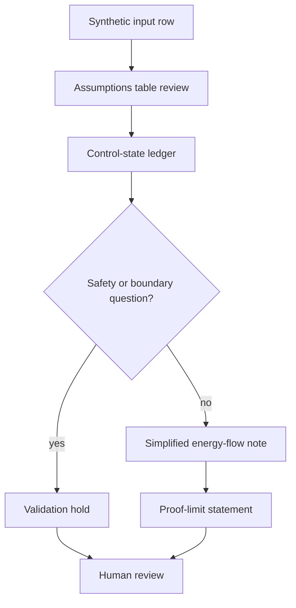

# Synthetic Solar To Hydrogen Control Ledger Study

Status: scaffolded

## Problem Statement

Create a public-safe synthetic study for reasoning about a solar-to-hydrogen control ledger without using deployed energy systems, proven output, private measurements, exact dimensions, production schematics, live operations, private sites, sealed designs, or sealed geometry.

## Synthetic Energy Context

The study models a non-production energy narrative with a generic solar resource class, a generic conversion request, an abstract hydrogen-storage boundary, and qualitative control states. It is a documentation and validation scaffold only.

The system context is intentionally simplified:

- Solar input is represented as a qualitative availability class.
- Conversion is represented as a reviewable state transition.
- Storage is represented as an abstract capacity class.
- Safety behavior is represented as non-certified review gates.
- Outputs are illustrative labels, not measured performance.

## Assumptions Table

| Assumption | Synthetic value | Boundary note |
| --- | --- | --- |
| Resource input | low / medium / high availability class | Not site data and not a private measurement |
| Conversion request | standby / requested / hold | Not live control logic |
| Storage state | available / limited / review-hold | Not an exact capacity or private measurement |
| Safety state | review-hold available | Not certified safety |
| Output label | illustrative only | Not proven output |
| Review posture | human review required | Not released or proof-complete |

## Synthetic Input References

| Input file | Purpose | Boundary |
| --- | --- | --- |
| `inputs/synthetic/solar_to_hydrogen_control_inputs.csv` | Example qualitative resource, conversion, storage, and review-state rows | Synthetic only |
| `inputs/synthetic/energy_control_states.json` | Generic control-state vocabulary | Not live operations |

## Control-State Ledger

| State | Entry condition | Review action | Exit condition | Boundary |
| --- | --- | --- | --- | --- |
| standby | No synthetic conversion request | Confirm no output claim is implied | Synthetic request appears | Not deployed energy |
| available-resource | Synthetic resource class is available | Check assumptions table | Conversion request is reviewed | Not site data |
| conversion-requested | Example study requests conversion | Check safety boundary and storage state | Move to storage-limited or validation-hold | Not live control logic |
| storage-limited | Abstract storage class reaches a limit | Hold conversion narrative for review | Return to standby or validation-hold | No exact dimensions or capacity |
| fault-review | Any assumption, boundary, or safety question appears | Pause and document the question | Human review resolves scope | Not certified safety |
| validation-hold | Study is ready for review | Run validator and boundary scan | Human approves next task | Not released |

## Simplified Energy-Flow Method

1. Read the synthetic input row.
2. Map the resource class to a qualitative resource state.
3. Check whether the conversion request is standby, requested, or hold.
4. Compare the storage class against a qualitative boundary.
5. Route the study state to validation-hold when assumptions or safety questions require review.
6. Record proof limits before any public creation, routing, or proof-stack update.

This method is a reasoning scaffold. It does not calculate production output, validated efficiency, hardware performance, system safety, or commercial readiness.

## Safety Boundary

Safety language in this artifact is non-certified and review-oriented. It may identify places where a review gate belongs, but it must not claim certified safety, deployment readiness, physical validation, commercial-readiness, or operational control.

Held safety-sensitive material includes production schematics, production CAD, BOMs, Gerbers, exact dimensions, private sites, private facility layouts, live operations, sealed designs, sealed geometry, and internal company product names.

## Validation Plan

| Check | Command or review method | Expected result |
| --- | --- | --- |
| File presence | `test -f solar-to-hydrogen/synthetic-solar-to-hydrogen-control-ledger-study.md` | PASS |
| Boundary script | `scripts/validate-public-boundary.sh` | PASS |
| Boundary/status scan | Plan-listed `rg` scan | Expected terms present as boundaries or status labels |
| Whitespace | `git diff --check` | PASS |
| Repo state | `git status --short` | Shows only intended local edits before commit |
| Remote state | `git remote -v` | Empty until public creation is approved |

## Mermaid Energy Validation Diagram

## Validation Questions

- Are all inputs synthetic and qualitative?
- Does the study avoid private measurements, private sites, private facility layouts, exact dimensions, and live operations?
- Does the study avoid deployed energy, proven output, certified safety, commercial-readiness, physical-validation, and proof-completion claims?
- Does the study avoid production CAD, production schematics, BOMs, Gerbers, sealed designs, and sealed geometry?
- Are public/private/sealed boundaries visible before any public creation or routing step?

## What This Proves

- A public-safe way to structure a synthetic energy control-ledger study.
- A repeatable pattern for assumptions, state transitions, validation questions, and proof-limit language.
- A local scaffold suitable for human review before public creation.

## What This Does Not Prove

- It does not prove energy output, conversion efficiency, hydrogen production, system safety, deployment readiness, commercial-readiness, physical validation, or certification.
- It does not document a deployed energy system, live control logic, private site, private facility layout, or production design.
- It does not release a public artifact or complete proof-stack routing.

## Public / Private / Sealed Checklist

| Boundary item | Status |
| --- | --- |
| Synthetic assumptions only | yes |
| Private measurements absent | yes |
| Customer data absent | yes |
| Foundation-private data absent | yes |
| Production CAD absent | yes |
| Production schematics absent | yes |
| BOMs and Gerbers absent | yes |
| Exact dimensions absent | yes |
| Live operations absent | yes |
| Private sites and private facility layouts absent | yes |
| Internal company product names absent | yes |
| Sealed designs and sealed geometry absent | yes |
| Release claim absent | yes |
| Proof-completion claim absent | yes |

## Boundary

This scaffold is not released, not published, and not proof-complete.
